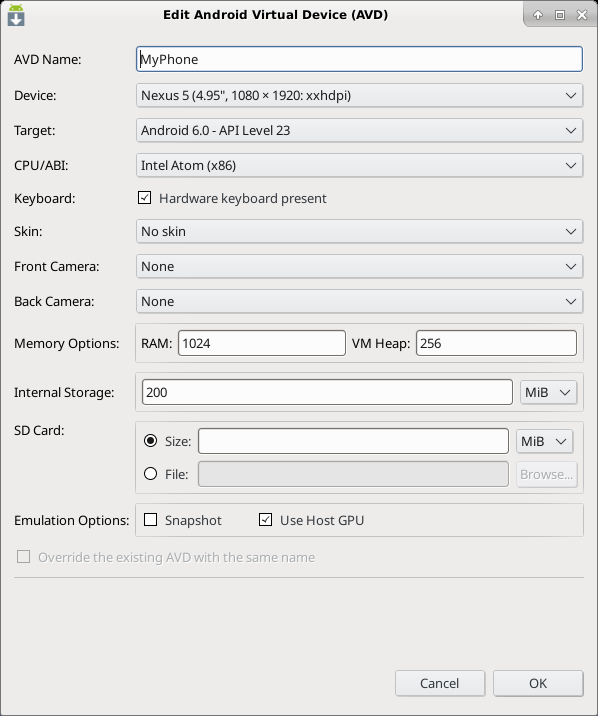

# Android SDL2 Demo

This is just a (not so) simple demo of using SDL2 with Android!

* [SDL2](https://www.libsdl.org/)
* [Android](https://developer.android.com/index.html)
* [Android NDK](https://developer.android.com/ndk/index.html)

Note that we will not use the IDE Android Studio. We will just use basic command
lines :-)

## Install Android SDK at Home

The following instructions show you how to install the Android development kit
(SDK & NDK) on a Linux/Debian system. Be careful, it will requires about 8GB of
free disk space!

**Nota Bene:** If you plan to work at CREMI, the following instructions are
useless. So, skip this section.

First, we need to fulfill some dependencies (not exhaustive list):

```bash
$ sudo apt-get install openjdk-8-jdk ant
```

Check your current version of java is JDK 8:

```bash
$ java -version 
$ javac -version 
```

Else, update your `JAVA_HOME` like this: `export JAVA_HOME=/usr/lib/jvm/jdk-8-oracle-x64/`

Then, we need to download the ~~latest~~ Android Tools and NDK (~1GB
compressed). Please visit official website, if the following links are not yet
available.

```bash
$ cd $HOME ; mkdir Android ; cd Android
$ wget https://dl.google.com/android/repository/tools_r25.2.3-linux.zip
$ wget https://dl.google.com/android/repository/android-ndk-r14b-linux-x86_64.zip
$ unzip tools_*.zip
$ unzip android-ndk-*.zip
```

Then, you can launch the SDK Manager to now install the right SDK version:

```bash
$ tools/android sdk &
```

Here, you need to select/update/unselect packages in order to have the following list:

* Tools / Android SDK Tools (latest)
* Tools / Android SDK Platform-tools (latest)
* Tools / Android SDK Build-tools (latest)
* Android 6.0 (API 23) / SDK Platform
* Android 6.0 (API 23) / Intel x86 Atom System Image

Don't forget to accept ALL Licences when the install process starts!

## Install Android SDK at CREMI

Clone thsi repository on your home directory at CREMI (University of Bordeaux).

Then, launch (only for the first time) the following script to move
`$HOME/.android` in a different place to save disk space:

```bash
$ ./init-cremi.sh
```

## Android Environnement

Assuming the Android SDK & NDK is well installed, you have to set the following
environment variables (env.sh).

```bash
ROOT=$HOME/Android
export ANDROID_HOME=$ROOT
export ANDROID_NDK_HOME=$ROOT/android-ndk-r14b
export PATH=$ANDROID_HOME/tools:$ANDROID_HOME/platform-tools:$ANDROID_NDK_HOME:${PATH}
```

After that, you should access from you PATH to the following commands: 
```java, android, ndk-build, ant, emulator, adb```.

At CREMI, just load the following script to set a correct environment in your
current terminal:

```bash
$ source cremi-env.sh
```

## Project Structure

By default, an Android project is built in Java with the SDK (Software
Development Kit). Nevertheless, it is possible to have some 'native' code in
C/C++ using the NDK (Native Development Kit). As SDL2 is written in C and
designed to be portable on Android, it provides some facilities based on the NDK
to help you running your SDL2 app on Android.

Here is the typical structure of an SDL Android project:

```
.
├── README.txt
├── AndroidManifest.xml
├── build.xml
├── src/org/libsdl/app/SDLActivity.java
├── jni
│   ├── Android.mk
│   ├── Application.mk
│   ├── SDL/...
│   ├── SDL_image/...
│   ├── SDL_ttf/...
│   └── src
│       ├── Android.mk
│       ├── demo.c
│       ├── main.c
│       ├── model.h
│       └── README.txt
├── assets/...
└── res/...
```

* AndroidManifest.xml: The high-level description of your Android application
  (label, icon, orientation, activity, ...).
* build.xml: The main build file for your Android application (used by Ant
  compiler). It defines the target Android version (SDK API level
  1)  and the package name.
* SDLActivity.java: This is the main Android "activity" for your SDL2
  application. In other words, it is the Java entry point of your Android
  application. This file is provided by SDL2. Don't modify it, unless you know
  what you do.
* res/ : Some specific Android resources as icons, layout, ...
* assets/ : Some application resources as images, fonts, ... They will be
  available in the final Android package (.apk).

All native code in C are located in the jni/ directory. It includes:

* Application.mk: This file describes both the Android version (api
  level 23) we target and the platform (x86 & arm) we target.
* Android.mk: This is the Makefile for the native part of your Android
  application (used by ndk-build compiler).
* the SDL2 libraries in jni/SDL*/ subdirectories;
* your SDL2 demo code in jni/src/* with the main SDL2 loop (called by
  SDLActivity.java)

**Nota Bene:** In practice, you will need to put your own SDL2 code in jni/src
and to update the Makefile Android.mk.
## Portability

Before running the demo on Android platform, you can test it on your Linux PC as
explained in 'jni/src/README.txt'.

The following lines can help you to have Android specific code in your
application.

```C
#ifdef __ANDROID__
  /* android code only */
#else
  /* generic code */
#endif
```

### Download SDL2

Your Android project requires to download the SDL2 library (and its extensions)
in the 'jni' directory. This is required because the SDL2 library is not
available on standard Android system. Besides, it must be cross-compiled for
multiple architectures we target (x86, arm, ...)

The following script will do the job for you.

```bash
$ ./download.sh
```

## Compilation

At this point, you can start the compilation of your Android project.

```bash
ndk-build        # first step
ant debug        # second step
```

In the first step, the 'ndk-build' command cross-compiles the SDL codes
(provided in jni/) and it generates in libs/ the following dynamic libraries
(.so) for the desired architectures.

```
libs/
├── armeabi-v7a
│   ├── libmain.so
│   ├── libSDL2_image.so
│   ├── libSDL2.so
│   └── libSDL2_ttf.so
└── x86
    ├── libmain.so
    ├── libSDL2_image.so
    ├── libSDL2.so
    └── libSDL2_ttf.so
```

In the second step, the 'ant debug' command compile the Java code (in src/) and
it finally generates an Android package (sdl2-demo-debug.apk) in the bin/
directory.  This package will contain all the stuffs needed for your app (native
libraries, assets, java bytecode, ..) to run on the target plaftorms.

## Deployment

You can deploy and run your application on both a real phone or an emulator.

### Deployment on Emulator

To create your own emulator or AVD (Android Virtual Device), launch the
following command:

```bash
$ android avd
```

Create an AVD with name 'MyPhone'. Set properties with something like 'Nexus 5'
device with Android 6.0 (API level 23) and CPU/ABI 'Intel Atom (x86)' without
Skin. Set RAM to 1024MB and Heap to 256MB. Use Host GPU (unless OpenGL ES could
fail). See the configuration snapshot of your AVD below.



Such an emulator is installed in the directory `$HOME/.android/avd/` and
requires at least 1GB for the Android system image!

Assuming you have already create such an emulator named 'MyPhone', you can check
it is available:

```bash
$ emulator -list-avds
MyPhone
```

And then, launch it as follows:

```bash
emulator -avd MyPhone
```

Now, you can deploy you app easily, assuming there is a single AVD running:

```bash
$ ant debug install
```

Now, find the 'SDL2 Demo' icon in the Android emulator... Enjoy!

### Deployment on a real phone (Android version >= 6.0)

First to activate the developer mode. For that, click 5 times on the [build
number](https://www.greenbot.com/article/2457986/how-to-enable-developer-options-on-your-android-phone-or-tablet.html).

Now, on your phone, allow "debug via USB"

Now connect your phone with a USB cable.

Now, on your phone, allow this particular computer to debug via the USB cable

Finally, on the computer run the deployment command:

```bash
$ ant debug install
```

### Android Log & Debug

Print log written by SDL_Log() routine in your app:

```bash
$ adb logcat -s 'SDL/APP'
```

Check Android properties:

```bash
$ adb shell getprop
```

GDB Debug (off-topic)

---
aurelien.esnard@u-bordeaux.fr
